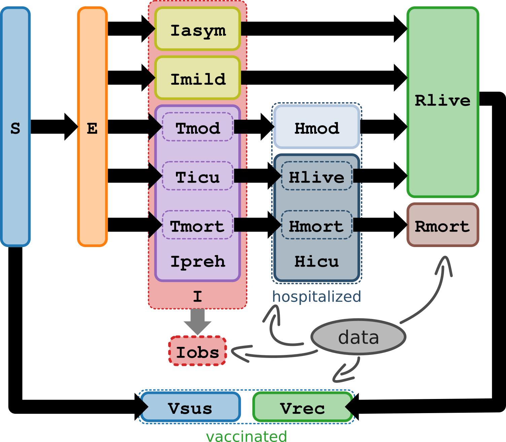

# The Santa Cruz County COVID-19 model

The Santa Cruz County (SCZ) COVID-19 model is a time-discrete, stochastic SEIR model that uses Bayseian statistical methods, such as Hamiltonian Markov Chain Monte Carlo (MCMC) simulations, to forecast the COVID-19 pandemic in Santa Cruz County, California. The model requires a set of parameters, equations, and local data to help inform its simulations.

The model contains 9 compartments to divide COVID-19 cases into the asymptomatic, mild, and moderate to severe illness, which better informs hospitalization and death projections (see diagram below). 

The Jupyter notebook using data from Santa Cruz County can be found [here](seir_v8.ipynb), a template notebook can be found [here](notyet.ipynb).

## Additional Assumptions of COVID-19 Model
- The model's contact rate adjusts every 10 days using spline interpolation
- COVID-19 cases who recover gain short-term immunity.
- COVID-19 cases can be infectious 2 to 3 days prior to symptom onset.
- COVID-19 hospitalization, ICU, and death rates calculated based on the overall age demographics of Santa Cruz County
- Not everyone who tests positive for COVID-19 goes to the hospital.
- COVID-19 cases only die within the hospital.
- Hospitalized COVID-19 patients have a shorter duration of their infectious period because they are less likely to expose other.      However, they likely will shed live virus longer, especially if immuno-compromised.
- Assumes social distancing lowers the contact rate by 60%. However, lifting the shelter in place orders could increase the contact rate anywhere from 0 to 20%. The model incorporates this during the time Shelter-In-Place was implemented on March 16th and then amended on May 1st.
- The model does not account for spatial or network patterns.

## Parameters of COVID-19 model for Santa Cruz

All parameters listed below can be adjusted by the user.

Parameter| Value and Distribution | Literature
---------|------------------------|-----------|
Contact Rate | exponential (.2, 30) | N/A|
Latent Period | normal(5, 2) | [Cascella et al](https://www.ncbi.nlm.nih.gov/books/NBK554776/); [Li et al](https://www.ncbi.nlm.nih.gov/books/NBK554776/) |
Asymptomatic Infections Days to Recover | normal(7, 5) | [He et al](https://www.nature.com/articles/s41591-020-0869-5)|
Mild Infections Days to Recover | normal(7,4)| [He et al](https://www.nature.com/articles/s41591-020-0869-5)|
Days to Hospital| normal(5,1)| [Ferguson et al](https://www.imperial.ac.uk/media/imperial-college/medicine/sph/ide/gida-fellowships/Imperial-College-COVID19-NPI-modelling-16-03-2020.pdf)|
Non-ICU Cases Days in Hospital |normal(7,1)|
ICU Cases Days in Hospital | normal(16, 1)|
Fraction Tested | normal(0.25, 0.025)|N/A|
Fraction of moderate cases (Hospitalized but non-ICU) | Dirichlet with mean 0.07[\[1\]](#dirichletfoootnote) | [Stanford model](https://surf.stanford.edu/covid-19-tools/covid-19/); [Ferguson et al](https://www.imperial.ac.uk/media/imperial-college/medicine/sph/ide/gida-fellowships/Imperial-College-COVID19-NPI-modelling-16-03-2020.pdf); [Verity et al](https://www.thelancet.com/journals/laninf/article/PIIS1473-3099(20)30243-7/fulltext#seccestitle200)
Fraction of severe cases (ICU and alive) | Dirichlet with mean 0.02[\[1\]](#dirichletfoootnote) | [Stanford model](https://surf.stanford.edu/covid-19-tools/covid-19/); [Ferguson et al](https://www.imperial.ac.uk/media/imperial-college/medicine/sph/ide/gida-fellowships/Imperial-College-COVID19-NPI-modelling-16-03-2020.pdf); [Verity et al](https://www.thelancet.com/journals/laninf/article/PIIS1473-3099(20)30243-7/fulltext#seccestitle200) |
Fraction of severe cases (ICU and dead) | Dirichlet with mean 0.01[\[1\]](#dirichletfoootnote) |[Stanford model](https://surf.stanford.edu/covid-19-tools/covid-19/); [Ferguson et al](https://www.imperial.ac.uk/media/imperial-college/medicine/sph/ide/gida-fellowships/Imperial-College-COVID19-NPI-modelling-16-03-2020.pdf); [Verity et al](https://www.thelancet.com/journals/laninf/article/PIIS1473-3099(20)30243-7/fulltext#seccestitle200) |
Fraction Asymptomatic cases | Dirichlet with mean 0.178[\[1\]](#dirichletfoootnote) |[Nishiura et al](https://www.ncbi.nlm.nih.gov/pubmed/32145466); [Mizumoto et al](https://www.eurosurveillance.org/content/10.2807/1560-7917.ES.2020.25.10.2000180#r13)|
Fraction of mild cases (non-hospitalized) | Dirichlet with mean 1-sum(0.07, 0.02, 0.01, 0.178)[\[1\]](#dirichletfoootnote) | N/A|
Population of Santa Cruz County | 273, 213| https://www.census.gov/quickfacts/santacruzcountycalifornia |

<a name="dirichletfoootnote">[1]</a> All 5 fractions are drawn from the same Dirichlet distribution. 

## License

This project is licensed under the MIT License - see the [LICENSE](LICENSE) file for details.

